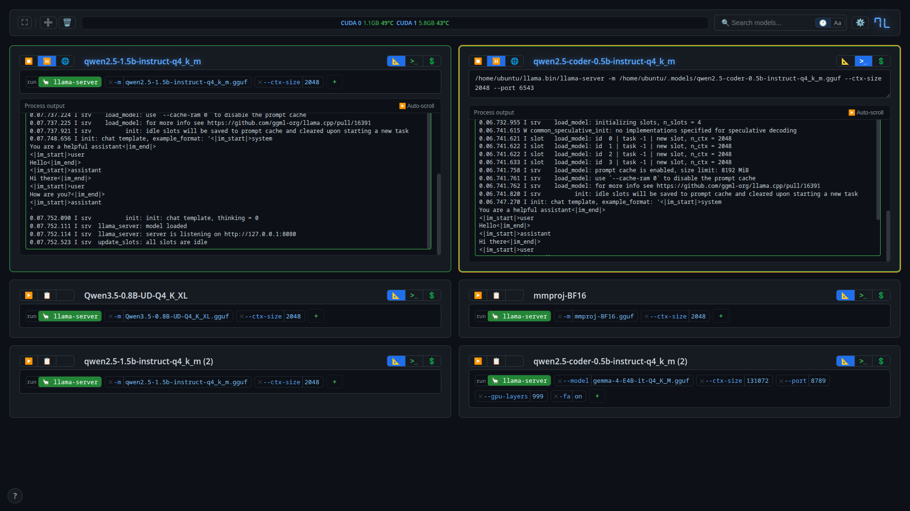

# 7L — llama.cpp Model Manager

7L is a lightweight web UI for running and managing multiple **llama.cpp** server instances side by side. Each model runs as a separate process with its own arguments, environment variables, and runtime binary.



## Quick Start

### Download a release

Grab the latest binary for your platform from the [releases page](https://github.com/shakhor-shual/7L/releases):

```bash
# Linux (amd64)
curl -LO https://github.com/shakhor-shual/7L/releases/latest/download/7L-linux-amd64
chmod +x 7L-linux-amd64
./7L-linux-amd64

# macOS (amd64)
curl -LO https://github.com/shakhor-shual/7L/releases/latest/download/7L-darwin-amd64
chmod +x 7L-darwin-amd64
./7L-darwin-amd64

# Windows (amd64, in PowerShell)
# curl -LO https://github.com/shakhor-shual/7L/releases/latest/download/7L-windows-amd64.exe
# .\7L-windows-amd64.exe
```

Open **http://localhost:7777** in your browser.

### Using the UI

1. Click **➕** in the header to add a card. Give it a nickname.
2. Use **📐 Constructor mode** to pick a model file (`-m`), set context size (`--ctx-size`), and add other parameters.
3. Optionally set a **custom runtime** by clicking **🦙** on the card, or configure a global runtime in settings.
4. Switch to **💲 Env mode** to add environment variables (`KEY=VALUE`, one per line) if needed.
5. Click **▶ Run**. The model nickname pulses blue while starting, then glows solid blue when ready.
6. Once ready, click **🌐 Chat** to open the llama.cpp server's built-in chat interface.
7. Click **⏹ Stop** to stop the model. Logs remain available for review.

## Features

- **Multiple instances** — Run several models at once, each with independent config.
- **Constructor mode** — Clickable UI for common flags: model, ctx-size, and more.
- **Raw args mode** — Full CLI string for arbitrary `llama-server` arguments.
- **Env variables** — Pass environment variables like `CUDA_VISIBLE_DEVICES`.
- **Custom runtime** — Per-card or global path to a specific `llama-server` binary.
- **GPU monitoring** — Live NVIDIA GPU stats: memory, temperature, power draw.
- **Log streaming** — Real-time stdout/stderr via SSE. Per-session history with collapsible blocks.
- **Search & sort** — Filter cards by name, sort by last used or alphabetically.
- **Expand view** — Focus on one card with the ⛶ button — full-height logs area.
- **Chat integration** — One-click 🌐 button opens llama.cpp's web chat on the model's port.

## Configuration

All card configurations are saved to `config.json` in the application directory:

```json
{ "global_runtime": "/path/to/llama-server", "configs": [...] }
```

Runtime resolution priority: **per-card → `--llama-bin` CLI flag → global config → `LLAMA_BIN` env → default `llama-server` in `$PATH`**.

## Build

```bash
go build -o 7L .
```

## Run

```bash
./7L
# Open http://localhost:7777
```
